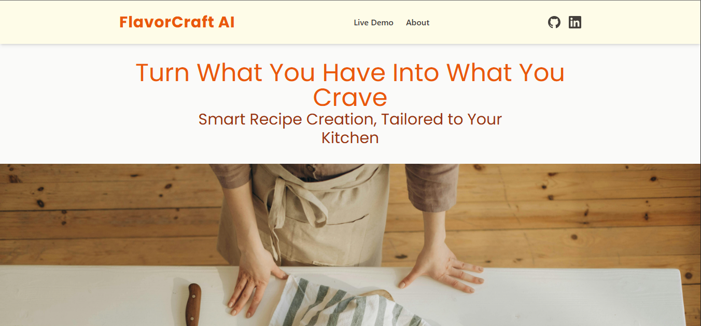
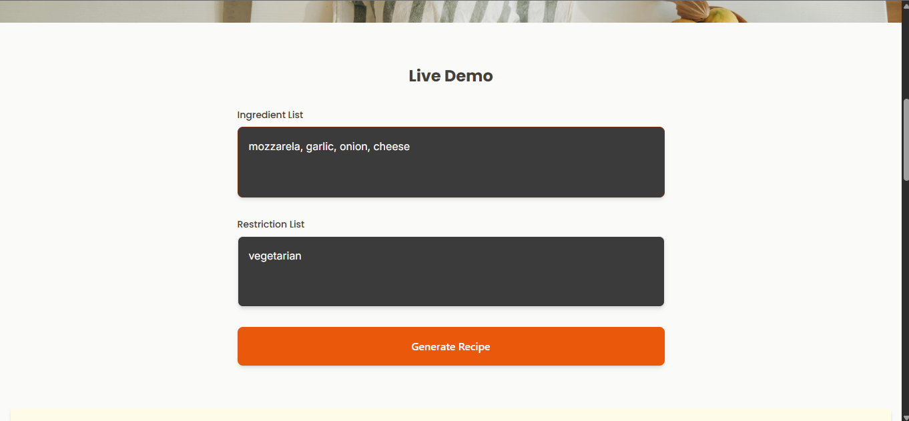
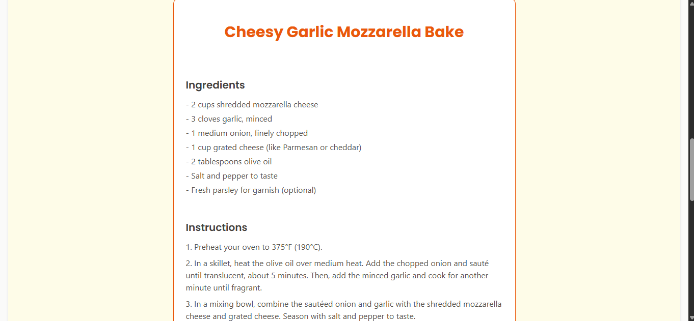
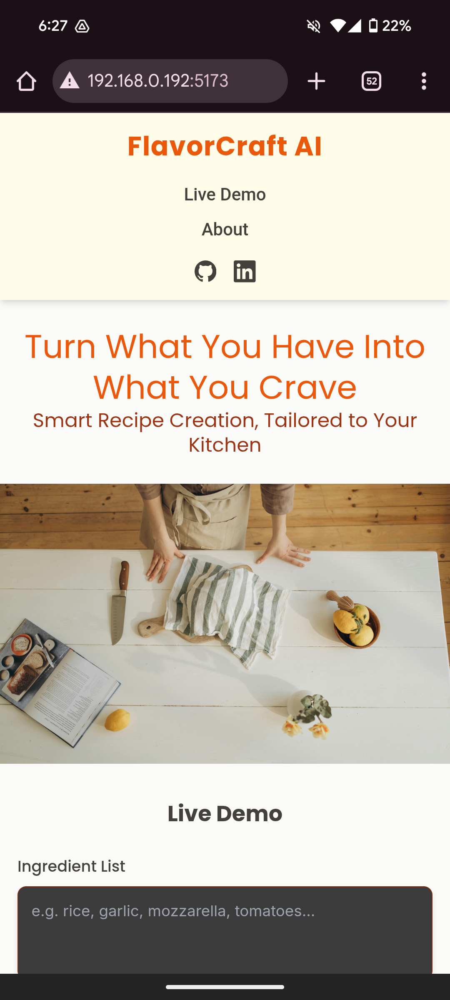
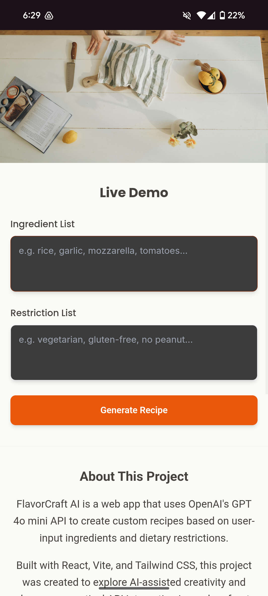
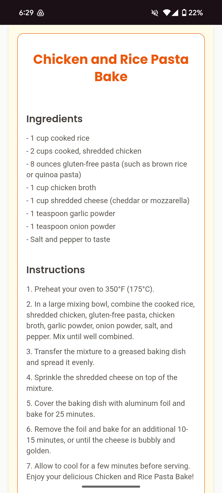

# FlavorCraft AI 🍳


**AI-Powered Recipe Generator** - Transform simple ingredients into culinary masterpieces with the power of artificial intelligence.

[](https://reactjs.org/)
[](https://vitejs.dev/)
[](https://tailwindcss.com/)
[](https://openai.com/)

## 🌟 Features

- **Smart Recipe Generation**: Input available ingredients and dietary preferences to get personalized recipes
- **AI-Powered Suggestions**: Leverages OpenAI's GPT model for creative and practical recipe recommendations
- **Responsive Design**: Beautiful, mobile-first interface that works seamlessly across all devices
- **Professional UI/UX**: Clean, modern design with a warm culinary color palette
- **Contact Integration**: Direct contact form for inquiries and feedback
- **Portfolio Ready**: Well-structured, documented code perfect for showcasing technical skills

## 🚀 Live Demo

[View Live Demo](https://your-app-url.vercel.app) _(Update with your deployment URL)_

## 📸 Screenshots

### Desktop




### Desktop




## 🛠️ Tech Stack

- **Frontend Framework**: React 18.2.0
- **Build Tool**: Vite 5.0.0
- **Styling**: Tailwind CSS 3.3.0
- **AI Integration**: OpenAI API (GPT-4o-mini)
- **Form Handling**: Formspree
- **Icons**: Simple Icons (SVG)
- **Fonts**: Google Fonts (Inter, Poppins)

## 🏗️ Project Structure

```
smart-recipe-generator/
├── public/
│   ├── img/
│   │   └── hero-image.jpg
│   └── index.html
├── src/
│   ├── components/
│   │   ├── About.jsx
│   │   ├── Contact.jsx
│   │   ├── Footer.jsx
│   │   ├── Hero.jsx
│   │   ├── Navbar.jsx
│   │   ├── RecipeDisplay.jsx
│   │   └── RecipeForm.jsx
│   ├── App.jsx
│   ├── index.css
│   └── main.jsx
├── .env
├── .gitignore
├── package.json
├── tailwind.config.js
└── vite.config.js
```

## 🚀 Getting Started

### Prerequisites

- Node.js (v16 or higher)
- npm or yarn
- OpenAI API key

### Installation

1. **Clone the repository**
   ```bash
   git clone https://github.com/yourusername/smart-recipe-generator.git
   cd smart-recipe-generator
   ```

2. **Install dependencies**
   ```bash
   npm install
   ```

3. **Set up environment variables**
   
   Create a `.env` file in the root directory:
   ```env
   VITE_OPENAI_API_KEY=your_openai_api_key_here
   ```
   
   > **Security Note**: Never commit your API key to version control. The `.env` file is already included in `.gitignore`.

4. **Start the development server**
   ```bash
   npm run dev
   ```

5. **Open your browser**
   
   Navigate to `http://localhost:5173` to see the application.

## 🔧 Available Scripts

- `npm run dev` - Start development server
- `npm run build` - Build for production
- `npm run preview` - Preview production build locally
- `npm run lint` - Run ESLint

## 🌐 Deployment

### Deploy to Vercel (Recommended)

1. **Install Vercel CLI**
   ```bash
   npm i -g vercel
   ```

2. **Deploy**
   ```bash
   vercel
   ```

3. **Set environment variables in Vercel Dashboard**
   - Go to your project settings
   - Add `VITE_OPENAI_API_KEY` with your OpenAI API key

### Alternative Deployment Options

- **Netlify**: Drag and drop the `dist` folder after running `npm run build`
- **GitHub Pages**: Use GitHub Actions for automated deployment
- **Firebase Hosting**: Deploy with Firebase CLI

## 🎨 Design Philosophy

FlavorCraft AI embraces a warm, culinary-inspired design system:

- **Color Palette**: Orange and lime accents on stone/neutral base
- **Typography**: Inter for UI elements, Poppins for headings
- **Layout**: Mobile-first responsive design with generous spacing
- **Accessibility**: High contrast ratios and semantic HTML structure

## 🔑 API Integration

The application integrates with OpenAI's API to generate recipes:

```javascript
// Example API call structure with cost optimization
const response = await fetch('https://api.openai.com/v1/chat/completions', {
  method: 'POST',
  headers: {
    'Authorization': `Bearer ${apiKey}`,
    'Content-Type': 'application/json',
  },
  body: JSON.stringify({
    model: 'gpt-4o-mini',
    messages: [{ role: 'user', content: prompt }],
    max_tokens: 500, // Optimized for cost efficiency
    temperature: 0.7,
  }),
});
```

## 🤝 Contributing

Contributions are welcome! Please feel free to submit a Pull Request. For major changes, please open an issue first to discuss what you would like to change.

1. Fork the project
2. Create your feature branch (`git checkout -b feature/AmazingFeature`)
3. Commit your changes (`git commit -m 'Add some AmazingFeature'`)
4. Push to the branch (`git push origin feature/AmazingFeature`)
5. Open a Pull Request

## 📝 License

This project is licensed under the MIT License - see the [LICENSE](LICENSE) file for details.

## 👨‍💻 Author

**Leo Franco** - *Full Stack Developer*

- GitHub: [@leorfernandes](https://github.com/leorfernandes)
- LinkedIn: [Leonardo dos Reis Fernandes](https://linkedin.com/in/leonardodosreisfernandes)

## 🙏 Acknowledgments

- OpenAI for providing the GPT API
- Tailwind CSS team for the excellent framework
- Vite team for the lightning-fast build tool
- React team for the robust frontend library

## 📈 Future Enhancements

- [ ] Recipe favoriting with local storage
- [ ] Social sharing functionality
- [ ] Recipe rating system
- [ ] User authentication
- [ ] Recipe categorization and filtering
- [ ] Nutritional information integration
- [ ] Meal planning features
- [ ] Shopping list generation

---

**Made with ❤️ and lots of ☕ by Leo Fernandes**
